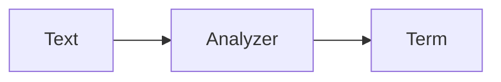
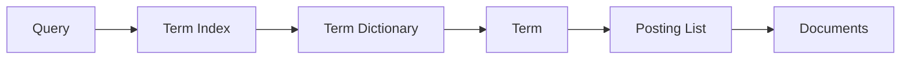

---
title: 使用 Elasticsearch 做一个好用的日语搜索引擎    
s: better-japanese-search-by-elasticsearch  
date: 2019-05-23 16:24:47    
tags:  
 - Elasticsearch  
 - 日语  
 - 搜索引擎  
 - 自动补全    
---    

@[toc]

最近基于 Elastic Stack 搭建了一个日语搜索服务，发现日文的搜索相比英语和中文，有不少特殊之处，因此记录下[用 Elasticsearch 搭建日语搜索引擎](https://avnpc.com/pages/japanese-morphological-analysis-compare)的全过程，帮助其他人少走弯路。本文所有的示例，适用于 Elastic 6.X 及 7.X 版本。
  
## 日语搜索的特殊性  
  
以 Elastic 的介绍语「Elasticsearchは、予期した結果や、そうでないものも検索できるようにデータを集めて格納するElastic Stackのコア製品です」为例。作为搜索引擎，当然希望用户能通过句子中的所有主要关键词，都能搜索到这条结果。  
  
和英文一样，日语的动词根据时态语境等，有多种变化。如例句中的「集めて」表示现在进行时，属于动词的连用形的て形，其终止形（可以理解为动词的原型）是「集める」。一个日文动词可以有 10 余种活用变形。如果依赖单纯的分词，用户在搜索「集める」时将无法匹配到这个句子。  
  
除动词外，日语的形容词也存在变形，如终止形「安い」可以有连用形「安く」、未然性「安かろ」、仮定形「安けれ」等多种变化。  

和中文一样，日文中存在多音词，特别是人名、地名等，如「相楽」在做人名和地名时就有 Sagara、Soraku、Saganaka 等不同的发音。  

同时日文中一个词还存在不同的拼写方式，如「空缶」 = 「空き缶」。

而作为搜索引擎，输入补全也是很重要的一个环节。从日语输入法来看，用户搜索时输入的形式也是多种多样，存在以下的可能性：  
  
- 平假名， 如「検索 -> けんさく」  
- 片假名全角，如 「検索 -> ケンサク」  
- 片假名半角，如「検索 -> ｹﾝｻｸ」  
- 汉字，如 「検索」  
- 罗马字全角，如「検索 -> ｋｅｎｎｓａｋｕ」  
- 罗马字半角，如「検索 -> kennsaku」  
  
等等。这和中文拼音有点类似，在用户搜索结果或者做输入补全时，我们也希望能尽可能适应用户的输入习惯，提升用户体验。  

  
## Elasticsearch 文本索引的过程  
  
Elasticsearch （下文简称 ES）作为一个比较成熟的搜索引擎，对上述这些问题，都有了一些解决方法  
  
先复习一下 ES 的文本在进行索引时将经历哪些过程，将一个文本存入一个字段 (Field) 时，可以指定唯一的分析器（Analyzer），Analyzer 的作用就是将源文本通过过滤、变形、分词等方式，转换为 ES 可以搜索的词元（Term），从而建立索引，即：  
  

  
一个 Analyzer 内部，又由 3 部分构成  
  
  
  
  
  
- **字符过滤器 (Character Filter)**: ，对文本进行字符过滤处理，如处理文本中的 html 标签字符。一个 Analyzer 中可包含 0 个或多个字符过滤器，多个按配置顺序依次进行处理。    
- **分词器 (Tokenizer)**: 对文本进行分词。一个 Analyzer 必需且只可包含一个 Tokenizer。    
- **词元过滤器 (Token filter)**:  对 Tokenizer 分出的词进行过滤处理。如转小写、停用词处理、同义词处理等。一个 Analyzer 可包含 0 个或多个词项过滤器，多个按配置顺序进行过滤。  
  
引用一张图说明应该更加形象  
  

  
ES 已经[内置了一些 Analyzers](https://www.elastic.co/guide/en/elasticsearch/reference/current/analysis-analyzers.html)，但显然对于日文搜索这种较复杂的场景，一般需要根据需求创建自定义的 Analyzer。  
  
  
另外 ES 还有[归一化处理器 (Normalizers)](https://www.elastic.co/guide/en/elasticsearch/reference/current/analysis-normalizers.html)的概念，可以将其理解为一个可以复用的 Analyzers, 比如我们的数据都是来源于英文网页，网页中的 html 字符，特殊字符的替换等等处理都是基本相同的，为了避免将这些通用的处理在每个 Analyzer 中都定义一遍，可以将其单独整理为一个 Normalizer。  
  

## 快速测试 Analyzer  
  
为了实现好的搜索效果，无疑会通过多种方式调整 Analyzer 的配置，为了更有效率，应该优先掌握快速测试 Analyzer 的方法， 这部分内容详见 [如何快速测试 Elasticsearch 的 Analyzer](https://avnpc.com/pages/test-elasticsearch-analyzer-efficient)， 此处不再赘述。
  
  
## Elasticsearch 日语分词器 (Tokenizer) 的比较与选择  

日语分词是一个比较大的话题，因此单独开了一篇文章[介绍和比较主流的开源日语分词项目](https://avnpc.com/pages/japanese-morphological-analysis-compare)。引用一下最终的结论

|  | 算法/模型 | 实现语言 | 词典 | 处理速度 | ES 插件 | Lisence |  
|--|--|--|--|--|--|--|--|  
| MeCab | CRF | C++ | 可选 | 最高 | [有](https://github.com/animalmatsuzawa/elasticsearch-analysis-mecab) | GPL/LGPL/BSD |  
| Kuromoji | Viterbi | Java | 可选, 默认 ipadic | 中 | 内置 | Apache License v2.0 |
| Juman++ | RNNLM | C++ | 自制 | 高 | 无 | Apache License v2.0 |
| KyTea | SVM 等 | C++ | UniDic | 中 | [有](https://github.com/yilee/elasticsearch-analysis-kytea) | Apache License v2.0 |
| Sudachi | Lattice LSTM | Java | UniDic + NEologd | 中 | [有](https://github.com/WorksApplications/elasticsearch-sudachi) | Apache License v2.0 |
| nagisa | Bi-LSTM | Python | ipadic | 低 | 无 | MIT |

对于 Elasticsearch，如果是项目初期，由于缺少数据，对于搜索结果优化还没有明确的目标，建议直接使用 Kuromoji 或者 Sudachi，安装方便，功能也比较齐全。项目中后期，考虑到分词质量和效率的优化，可以更换为 MeCab 或 Juman++。 本文将以 Kuromoji 为例。

## 日语搜索相关的 Token Filter

在 Tokenizer 已经确定的基础上，日语搜索其他的优化都依靠 Token filter 来完成，这其中包括 ES 内置的 Token filter 以及 Kuromoji 附带的 Token filter，以下逐一介绍

#### [Lowercase Token Filter (小写过滤)](https://www.elastic.co/guide/en/elasticsearch/reference/current/analysis-lowercase-tokenfilter.html)

将英文转为小写， 几乎任何大部分搜索的通用设置

``` json
POST _analyze
{
  "tokenizer": "kuromoji_tokenizer",
  "filter": ["lowercase"],
  "text": "Ironman"
}

Response
{
  "tokens": [
    {
      "token": "ironman",
      "start_offset": 0,
      "end_offset": 7,
      "type": "word",
      "position": 0
    }
  ]
}
```

#### [CJK Width Token Filter (CJK 宽度过滤)](https://www.elastic.co/guide/en/elasticsearch/reference/current/analysis-cjk-width-tokenfilter.html)

将全角 ASCII 字符 转换为半角 ASCII 字符


``` json
POST _analyze
{
  "tokenizer": "kuromoji_tokenizer",
  "filter": ["cjk_width"],
  "text": "ｋｅｎｎｓａｋｕ"
}

{
  "tokens": [
    {
      "token": "kennsaku",
      "start_offset": 0,
      "end_offset": 8,
      "type": "word",
      "position": 0
    }
  ]
}
```

以及将半角片假名转换为全角

``` json
POST _analyze
{
  "tokenizer": "kuromoji_tokenizer",
  "filter": ["cjk_width"],
  "text": "ｹﾝｻｸ"
}

{
  "tokens": [
    {
      "token": "ケンサク",
      "start_offset": 0,
      "end_offset": 4,
      "type": "word",
      "position": 0
    }
  ]
}
```

####  [`ja_stop`  Token Filter (日语停止词过滤)](https://www.elastic.co/guide/en/elasticsearch/plugins/current/analysis-kuromoji-stop.html)

一般来讲，日语的停止词主要包括部分助词、助动词、连接词及标点符号等，Kuromoji 默认使用的停止词参考[lucene 日语停止词源码](https://github.com/apache/lucene-solr/blob/master/lucene/analysis/kuromoji/src/resources/org/apache/lucene/analysis/ja/stopwords.txt)。 再次基础上也可以自己在配置中添加停止词

``` json
POST _analyze
{
  "tokenizer": "kuromoji_tokenizer",
  "filter": ["ja_stop"],
  "text": "Kuromojiのストップワード"
}

{
  "tokens": [
    {
      "token": "Kuromoji",
      "start_offset": 0,
      "end_offset": 8,
      "type": "word",
      "position": 0
    },
    {
      "token": "ストップ",
      "start_offset": 9,
      "end_offset": 13,
      "type": "word",
      "position": 2
    },
    {
      "token": "ワード",
      "start_offset": 13,
      "end_offset": 16,
      "type": "word",
      "position": 3
    }
  ]
}
```

#### [`kuromoji_baseform`  Token Filter (日语词根过滤)](https://www.elastic.co/guide/en/elasticsearch/plugins/current/analysis-kuromoji-baseform.html)

将动词、形容词转换为该词的词根

``` json
POST _analyze
{
  "tokenizer": "kuromoji_tokenizer",
  "filter": ["kuromoji_baseform"],
  "text": "飲み"
}

{
  "tokens": [
    {
      "token": "飲む",
      "start_offset": 0,
      "end_offset": 2,
      "type": "word",
      "position": 0
    }
  ]
}
```

#### [`kuromoji_readingform`  Token Filter (日语读音过滤)](https://www.elastic.co/guide/en/elasticsearch/plugins/current/analysis-kuromoji-readingform.html)

将单词转换为发音，发音可以是片假名或罗马字 2 种形式

```json
POST _analyze
{
  "tokenizer": "kuromoji_tokenizer",
  "filter": ["kuromoji_readingform"],
  "text": "寿司"
}

{
  "tokens": [
    {
      "token": "スシ",
      "start_offset": 0,
      "end_offset": 2,
      "type": "word",
      "position": 0
    }
  ]
}
```

```json
POST _analyze
{
  "tokenizer": "kuromoji_tokenizer",
  "filter": [{
     "type": "kuromoji_readingform", "use_romaji": true
   }],
  "text": "寿司"
}

{
  "tokens": [
    {
      "token": "sushi",
      "start_offset": 0,
      "end_offset": 2,
      "type": "word",
      "position": 0
    }
  ]
}
```

当遇到多音词时，读音过滤仅会给出一个读音。

#### [`kuromoji_part_of_speech`  Token Filter (日语语气词过滤)](https://www.elastic.co/guide/en/elasticsearch/plugins/current/analysis-kuromoji-speech.html)

语气词过滤与停止词过滤有一定重合之处，语气词过滤范围更广。停止词过滤的对象是固定的词语列表，停止词过滤则是根据词性过滤的，具体过滤的对象参考[源代码](https://github.com/apache/lucene-solr/blob/master/lucene/analysis/kuromoji/src/resources/org/apache/lucene/analysis/ja/stoptags.txt)。

```json
POST _analyze
{
  "tokenizer": "kuromoji_tokenizer",
  "filter": ["kuromoji_part_of_speech"],
  "text": "寿司がおいしいね"
}

{
  "tokens": [
    {
      "token": "寿司",
      "start_offset": 0,
      "end_offset": 2,
      "type": "word",
      "position": 0
    },
    {
      "token": "おいしい",
      "start_offset": 3,
      "end_offset": 7,
      "type": "word",
      "position": 2
    }
  ]
}
```


#### [`kuromoji_stemmer`  Token Filter (日语长音过滤)](https://www.elastic.co/guide/en/elasticsearch/plugins/current/analysis-kuromoji-stemmer.html)

去除一些单词末尾的长音， 如「コンピューター」 => 「コンピュータ」

```json
POST _analyze
{
  "tokenizer": "kuromoji_tokenizer",
  "filter": ["kuromoji_stemmer"],
  "text": "コンピューター"
}

{
  "tokens": [
    {
      "token": "コンピュータ",
      "start_offset": 0,
      "end_offset": 7,
      "type": "word",
      "position": 0
    }
  ]
}
```

#### [`kuromoji_number`  Token Filter (日语数字过滤)](https://www.elastic.co/guide/en/elasticsearch/plugins/current/analysis-kuromoji-number.html)

将汉字的数字转换为 ASCII 数字

```json
POST _analyze
{
  "tokenizer": "kuromoji_tokenizer",
  "filter": ["kuromoji_number"],
  "text": "一〇〇〇"
}

{
  "tokens": [
    {
      "token": "1000",
      "start_offset": 0,
      "end_offset": 4,
      "type": "word",
      "position": 0
    }
  ]
}
```

## 日语全文检索 Analyzer 配置

基于上述这些组件，不难得出一个完整的日语全文检索 Analyzer 配置

```json
PUT my_index
{
  "settings": {
    "analysis": {
      "analyzer": {
        "ja_fulltext_analyzer": {
          "type": "custom",
          "tokenizer": "kuromoji_tokenizer",
          "filter": [
            "cjk_width",
            "lowercase",
            "kuromoji_stemmer",
            "ja_stop",
            "kuromoji_part_of_speech",
            "kuromoji_baseform"
          ]
        }
      }
    }
  },
  "mappings": {
    "my_type": {
      "properties": {
        "title": {
          "type": "text",
          "analyzer": "ja_fulltext_analyzer"
        }
      }
    }
  }
}
```

其实这也正是 [`kuromoji`  analyzer](https://www.elastic.co/guide/en/elasticsearch/plugins/current/analysis-kuromoji-analyzer.html) 所使用的配置，因此上面等价于

```json
PUT my_index
{
  "mappings": {
    "my_type": {
      "properties": {
        "title": {
          "type": "text",
          "analyzer": "kuromoji"
        }
      }
    }
  }
}
```

这样的默认设置已经可以应对一般情况，采用默认设置的主要问题是词典未经打磨，一些新词语或者专业领域的分词不准确，如「東京スカイツリー」期待的分词结果是 「東京/スカイツリー」，实际分词结果是「東京/スカイ/ツリー」。进而导致一些搜索排名不够理想。这个问题可以将词典切换到 UniDic + NEologd，能更多覆盖新词及网络用语，从而得到一些改善。同时也需要根据用户搜索，不断维护自己的词典。而自定义词典，也能解决一词多拼以及多音词的问题。

至于本文开始提到的假名读音匹配问题，很容易想到加入 `kuromoji_readingform`，这样索引最终存储的 Term 都是假名形式，确实可以解决假名输入的问题，但是这又会引发新的问题：

一方面，`kuromoji_readingform` 所转换的假名读音并不一定准确，特别是遇到一些不常见的拼写，比如「明るい」-> 「アカルイ」正确，「明るい」的[送りがな](https://ja.wikipedia.org/wiki/%E9%80%81%E3%82%8A%E3%81%8C%E3%81%AA)拼写「明かるい」就会转换为错误的「メイ・カルイ」

另一方面，日文中相同的假名对应不同汉字也是极为常见，如「シアワセ」可以写作「幸せ」、「仕合わせ」等。

因此`kuromoji_readingform`并不适用于大多数场景，在输入补全，以及已知读音的人名、地名等搜索时，可以酌情加入。


## 日语自动补全的实现


Elasticsearch 的补全(Suggester)有 4 种：Term Suggester 和 Phrase Suggester 是根据输入查找形似的词或词组，主要用于输入纠错，常见的场景是"你是不是要找 XXX"；Context Suggester 个人理解一般用于对自动补全加上其他字段的限定条件，相当于 query 中的 filter；因此这里着重介绍最常用的 Completion Suggester。

Completion Suggester 需要响应每一个字符的输入，对性能要求非常高，因此 ES 为此使用了新的数据结构：[完全装载到内存的 FST(In Memory FST)](https://www.elastic.co/cn/blog/you-complete-me)， 类型为 `completion`。众所周知，ES 的数据类型主要采用的是倒排索引(Inverse Index)， 但由于 Term 数据量非常大，又引入了 term dictionary 和 term index，因此一个搜索请求会经过以下的流程。



completion 则省略了 term dictionary 和 term index，也不需要从多个 nodes 合并结果，仅适用内存就能完成计算，因此性能非常高。但由于仅使用了 FST 一种数据结构，只能实现前缀搜索。

了解了这些背景知识，来考虑一下如何构建日语的自动补全。

和全文检索不同，在自动补全中，对读音和罗马字的匹配有非常强的需求，比如用户在输入「銀魂」。按照用户的输入顺序，实际产生的字符应当是

- gin
- ぎん
- 銀
- 銀 t
- 銀 tama
- 銀魂

理想状况应当让上述的所有输入都能匹配到「銀魂」，那么如何实现这样一个自动补全呢。常见的方法是针对汉字、假名、罗马字各准备一个字段，在输入时同时对 3 个字段做自动补全，然后再合并补全的结果。

来看一个实际的例子， 下面建立的索引中，创建了 2 种 Token Filter，`kuromoji_readingform`可以将文本转换为片假名，`romaji_readingform`则可以将文本转换为罗马字，将其与`kuromoji` Analyzer 组合，就得到了对应的自定义 Analyzer `ja_reading_analyzer` 和 `ja_romaji_analyzer` 。

对于 title 字段，分别用不同的 Analyzer 进行索引：

- `title`: text 类型，使用 `kuromoji` Analyzer， 用于普通关键词搜索
- `title.suggestion`:  completion 类型， 使用 `kuromoji` Analyzer，用于带汉字的自动补全
- `title.reading`: completion 类型， 使用 `ja_reading_analyzer` Analyzer，用于假名的自动补全
- `title.romaji`: completion 类型， 使用 `ja_romaji_analyzer` Analyzer，用于罗马字的自动补全

```json
PUT my_index
{
  "settings": {
    "analysis": {
      "filter": {
        "katakana_readingform": {
          "type": "kuromoji_readingform",
          "use_romaji": "false"
        },
        "romaji_readingform": {
          "type": "kuromoji_readingform",
          "use_romaji": "true"
        }
      },
      "analyzer": {
        "ja_reading_analyzer": {
          "type": "custom",
          "filter": [
            "cjk_width",
            "lowercase",
            "kuromoji_stemmer",
            "ja_stop",
            "kuromoji_part_of_speech",
            "kuromoji_baseform",
            "katakana_readingform"
          ],
          "tokenizer": "kuromoji_tokenizer"
        },
        "ja_romaji_analyzer": {
          "type": "custom",
          "filter": [
            "cjk_width",
            "lowercase",
            "kuromoji_stemmer",
            "ja_stop",
            "kuromoji_part_of_speech",
            "kuromoji_baseform",
            "romaji_readingform"
          ],
          "tokenizer": "kuromoji_tokenizer"
        }
      }
    }
  },
  "mappings": {
    "my_type": {
      "properties": {
        "title": {
          "type": "text",
          "analyzer": "kuromoji",
          "fields": {
            "reading": {
              "type": "completion",
              "analyzer": "ja_reading_analyzer",
              "preserve_separators": false,
              "preserve_position_increments": false,
              "max_input_length": 20
            },
            "romaji": {
              "type": "completion",
              "analyzer": "ja_romaji_analyzer",
              "preserve_separators": false,
              "preserve_position_increments": false,
              "max_input_length": 20
            },
            "suggestion": {
              "type": "completion",
              "analyzer": "kuromoji",
              "preserve_separators": false,
              "preserve_position_increments": false,
              "max_input_length": 20
            }
          }
        }
      }
    }
  }
}
```

插入示例数据

```json
POST _bulk
{ "index": { "_index": "my_index", "_type": "my_type", "_id": 1} }
{ "title": "銀魂" }
```

然后运行自动补全的查询

```json
GET my_index/_search
{
    "suggest": {
    "title": {
      "prefix": "gin",
      "completion": {
        "field": "title.suggestion",
        "size": 20
      }
    },
    "titleReading": {
      "prefix": "gin",
      "completion": {
        "field": "title.reading",
        "size": 20
      }
    },
    "titleRomaji": {
      "prefix": "gin",
      "completion": {
        "field": "title.romaji",
        "size": 20
      }
    }
  }
}
```

可以看到不同输入的命中情况

- gin:  命中 `title.romaji`
- ぎん: 命中 `title.reading` 和  `title.romaji`
- 銀: 命中 `title.suggestion`, `title.reading` 和  `title.romaji`
- 銀 t:  命中 `title.romaji`
- 銀たま: 命中 `title.reading` 和  `title.romaji`
- 銀魂: 命中 `title.suggestion`, `title.reading` 和  `title.romaji`


## References

- [All About Analyzers](https://www.elastic.co/cn/blog/found-text-analysis-part-1)
- [Writing analyzers](https://www.elastic.co/guide/en/elasticsearch/client/net-api/current/writing-analyzers.html)  
- [Elasticsearch 6 を使ったデータ検証](https://developer-collaboration.com/2018/08/24/elasticsearch-6-7/)  
- [Elasticsearch キーワードサジェスト日本語のための設計](https://medium.com/hello-elasticsearch/elasticsearch-%E3%82%AD%E3%83%BC%E3%83%AF%E3%83%BC%E3%83%89%E3%82%B5%E3%82%B8%E3%82%A7%E3%82%B9%E3%83%88%E6%97%A5%E6%9C%AC%E8%AA%9E%E3%81%AE%E3%81%9F%E3%82%81%E3%81%AE%E8%A8%AD%E8%A8%88-352a230030dd)  
- [Elasticsearchを日本語で使う設定のまとめ](https://qiita.com/shin_hayata/items/41c07923dbf58f13eec4)
- [Lucene 查询原理](https://zhuanlan.zhihu.com/p/35814539)