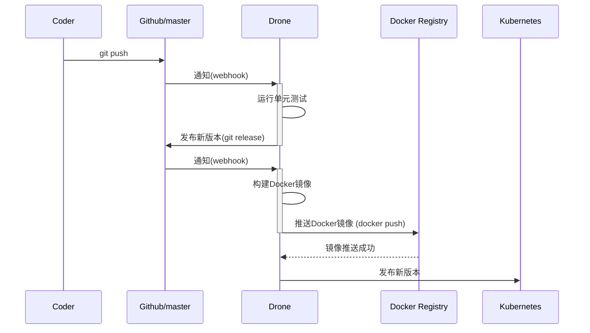
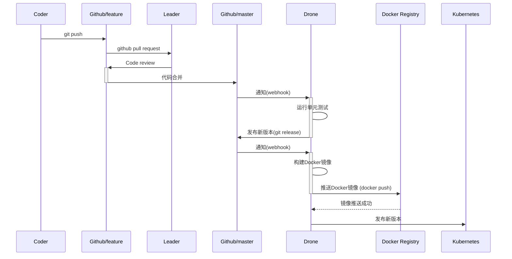
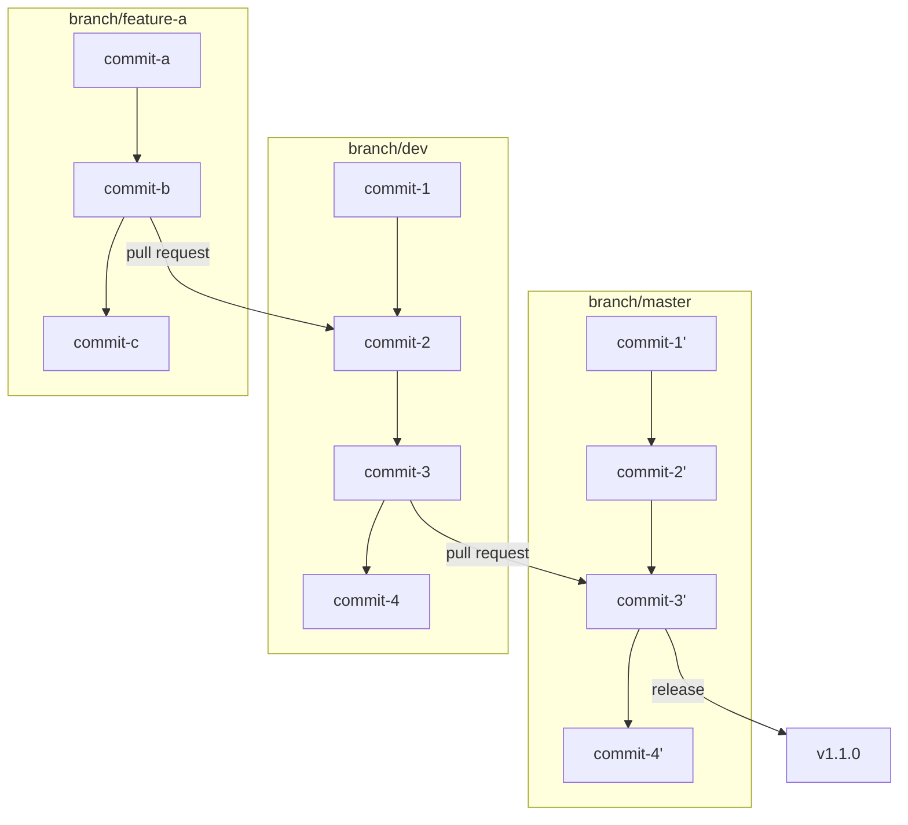

---  
title: 容器环境下的持续集成最佳实践：构建基于 Drone + GitFlow + K8s 的云原生语义化 CI 工作流  
s: drone-gitflow-kubernetes-for-cloud-native-ci  
date: 2019-03-22 23:58:36
published: true
tags: 
  - drone
  - kubernetes
  - gitflow
  - ci
  - cloud native
  - semantic release
---  
 
云原生 (Cloud Native) 是伴随的容器技术发展出现的的一个词，最早出自 Pivotal 公司（即开发了 Spring 的公司）的一本技术小册子 [Migrating to Cloud-Native Application Architectures](https://content.pivotal.io/ebooks/migrating-to-cloud-native-application-architectures)， 其中定义了云原生应用应当具备的一些特质，如无状态、可持续交付、微服务化等。随后云原生概念被广为引用，并围绕这一概念由数家大厂牵头，成立了 [CNCF 基金会](https://www.cncf.io/)来推进云原生相关技术的发展，主要投资并孵化云原生生态内的若干项目，包括了如 Kubernetes / etcd / CoreDNS 等耳熟能详的重要项目。而这张大大的[云原生版图](https://landscape.cncf.io/)仍然在不断的扩展和完善。

从个人理解来说，传统的应用由于年代久远，更多会考虑单机部署、进程间通信等典型的“单机问题”，虽然也能工作在容器下，但由于历史包袱等原因，架构上已经很难做出大的调整。而“云原生”的应用大都是从一开始就为容器而准备，很少考虑在单机环境下使用，有些甚至无法脱离容器环境工作；考虑的场景少，从而更轻量，迭代更快。比如 etcd 之于 zookeeper ， traefik 之于 nginx 等，相信只要在容器环境下实现一次同样的功能，就能强烈的体会到云原生应用所特有的便捷之处。

在 CNCF 的版图下，[持续集成与持续交付(Continuous Integration & Delivery)](https://landscape.cncf.io/category=continuous-integration-delivery&format=card-mode&grouping=category)板块一直缺少一个钦定的主角，虽然也不乏 Travis CI、GitLab、Jenkins 这样的知名项目，但最能给人云原生应用感觉的，应该还是 [Drone](https://drone.io/) 这个项目，本文将[围绕 Drone 结合 GitFlow 及 Kubernetes 介绍一些容器环境下持续集成、持续发布 (CI/CD) 方面的实践经验](https://avnpc.com/pages/drone-gitflow-kubernetes-for-cloud-native-ci )。

## 主流 CI/CD 应用对比

之前我也介绍过[基于 Travis CI 的一些持续集成实践](https://avnpc.com/pages/android-auto-deploy-workflow-on-travis-ci)。后来经过一些比较和调研，最终选择了 Drone 作为主力 CI 工具。截止本文，团队已经使用 Drone 有 2 年多的时间，从 v0.6 一路用到现在即将发布的 v1.0，虽然也踩了不少坑，但总的来说 Drone 还是可以满足大部分需求，并以不错的势头在完善和发展的。

下面这张表总结了主流的几个 CI/CD 应用的特点

| 项目名称 | 开发语言 |  配置语言 | 公有云服务 | 私有部署 | 备注 |   
|--|--|--|--|--|--|
| Travis CI | Ruby | YAML | 有 | 不支持 | 公共项目免费,私有项目 $69/单进程, $129/2 进程 |
| CircleCI | Clojure | YAML | 有 | 不支持 | 单进程免费，$50/加 1 进程 |
| Gitlab CI | Ruby | YAML | 有 | 支持 | 绑定 Gitlab 代码管理 |
| Jenkins | Java | Groovy | 无 | 支持 |  |
| Drone | Go | YAML | 有 | 支持 | Cloud 版本不支持私有项目，自建版本无此限制 |

Travis CI 和 CircleCI 是目前[占有率最高的两个公有云 CI](https://www.datanyze.com/market-share/ci/jenkins-market-share)，易用性上相差无几，只是收费方式有差异。由于不支持私有部署，如果并行的任务量一大，按进程收费其实并不划算；而且由于服务器位置的原因，如果推送镜像到国内，速度很不理想。

Gitlab CI 虽然好用，但和 Gitlab 是深度绑定的，我们的代码托管在 Github，整体迁移代码库的成本太大，放弃。

Jenkins 作为老牌劲旅，也是目前市场占有率最高的 CI，几乎可以覆盖所有 CI 的使用场景，由于使用 Java 编写，配置文件使用 Groovy 语法，非常适合 Java 为主语言的团队。Jenkins 显然是可以满足我们需要的，只是团队并非 Java 为主，又已经习惯了使用 YAML 书写 CI 配置，抱着尝鲜的心态，将 Jenkins 作为了保底的选择。

综上，最终选择 Drone 的结论也就不难得出了，Drone 即开源，又可以私有化部署，同时作为云原生应用，官方提供了针对 Docker、Docker Swarm、K8s 等多种容器场景下的部署方案，针对不同容器场景还有特别优化，比如在 Docker Swarm 下 Drone 是以 agent 方式运行 CI 任务的，而在 K8s 下则通过创建 K8s Job 来实现，显然充分利用了容器的优势所在，这也是 Drone 优于其他 CI 应用之处。个人还觉得 Drone 的语法是所有 CI 中最容易理解和掌握的，由于 Drone 每一个步骤都是运行一个 Docker 容器，本地模拟或调试也非常容易。

一句话概况 Drone，可以将其看做是可以支持私有化部署的开源版 CircleCI，并且目前仍然没有看到有其他主打这个定位的 CI 工具，因此个人认为 Drone 是 CI/CD 方面云原生应用头把交椅的有力竞争者。

## 容器环境下一次规范的发布应该包含哪些内容

技术选型完成后，我想首先演示一下最终的成果，希望能直观的体现出 CI 对自动化效率起到的提升，不过这就涉及到一个问题：在容器环境下，一次发布应该包含哪些内容，其中有哪些部分是可以被 CI 自动化完成的。这个问题虽然每家公司各不相同，不过按经验来说，容器环境下一次版本发布通常包含这样一个 Checklist：

- [ ] 代码的下载构建及编译
- [ ]  运行单元测试，生成单元测试报告及覆盖率报告等
- [ ]  在测试环境对当前版本进行测试
- [ ]  为待发布的代码打上版本号
- [ ]  编写 ChangeLog 说明当前版本所涉及的修改
- [ ]  构建 Docker 镜像
- [ ]  将 Docker 镜像推送到镜像仓库
- [ ]  在预发布环境测试当前版本
- [ ]  正式发布到生产环境

看上去很繁琐对吗，如果每次发布都需要人工去处理上述的所有内容，不仅容易出错，而且也无法应对 DevOps 时代一天至少数次的发布频率，那么下面就来使用 CI 来解决所有问题吧。

## CI 流程演示

为了对 CI 流程有最直观的认识，我创建了一个精简版的 Github 项目 [AlloVince/drone-ci-demo](https://github.com/AlloVince/drone-ci-demo) 来演示完整的流程，同时项目对应的 CI 地址是 [cloud.drone.io/AlloVince/drone-ci-demo](https://cloud.drone.io/AlloVince/drone-ci-demo) ，项目自动构建的 Docker 镜像会推送到 [docker registry 的 allovince/drone-ci-demo](https://cloud.docker.com/repository/docker/allovince/drone-ci-demo)，。为了方便说明，假设这个项目的核心文件只有 `index.html` 一个静态页面。

### 单人开发模式

目前这个项目背后的 CI 都已经配置部署好，假设我是这个项目的唯一开发人员，如何开发一个新功能并发布新版本呢？

1. Clone 项目到本地， 修改项目代码， 如将 `Hello World` 改为 `Hello World V2`。
2. `git add .`，然后书写符合约定的 Commit 并提交代码， `git commit -m "feature: hello world v2”`
3. 推送代码到代码库`git push`，等待数分钟后，开发人员会看到单元测试结果，Github 仓库会产生一次新版本的 release，release 内容为当前版本的 ChangeLog， 同时线上已经完成了新功能的发布。

虽然在开发者看来，一次发布简单到只需 3 个指令，但背后经过了如下的若干次交互，这是一次发布实际产生交互的时序图，具体每个环节如何工作将在后文中详细说明。



### 多人开发模式

一个项目一般不止一个开发人员，比如我是新加入这个项目的成员，在这个 Demo 中应该如何上线新功能呢？同样非常简单：

1. Clone 项目到本地，创建一个分支来完成新功能的开发, `git checkout -b feature/hello-world-v3`。在这个分支修改一些代码，比如将`Hello World V2`修改为`Hello World V3`
2. `git add .`，书写符合规范的 Commit 并提交代码， `git commit -m "feature: hello world v3”`
3. 将代码推送到代码库的对应分支， `git push origin feature/hello-world`
4. 如果功能已经开发完毕，可以向 Master 分支发起一个 Pull Request，并让项目的负责人 Code Review
5. Review 通过后，项目负责人将分支合并入主干，Github 仓库会产生一次新版本的 release，同时线上已经完成了新功能的发布。

这个流程相比单人开发来多了 2 个环节，很适用于小团队合作，不仅强制加入了 Code Review 把控代码质量，同时也避免新人的不规范行为对发布带来影响。实际项目中，可以在 Github 的设置界面对 master 分支设置写入保护，这样就从根本上杜绝了误操作的可能。当然如果团队中都是熟手，就无需如此谨慎，每个人都可以负责 PR 的合并，从而进一步提升效率。



### GitFlow 开发模式

在更大的项目中，参与的角色更多，一般会有开发、测试、运维几种角色的划分；还会划分出开发环境、测试环境、预发布环境、生产环境等用于代码的验证和测试；同时还会有多个功能会在同一时间并行开发。可想而知 CI 的流程也会进一步复杂。

能比较好应对这种复杂性的，首选 [GitFlow 工作流](https://nvie.com/posts/a-successful-git-branching-model/)， 即通过并行两个长期分支的方式规范代码的提交。而如果使用了 Github，由于有非常好用的 Pull Request 功能，可以将 GitFlow 进行一定程度的简化，最终有这样的工作流：



- 以 dev 为主开发分支，master 为发布分支
- 开发人员始终从 dev 创建自己的分支，如 feature-a
- feature-a 开发完毕后创建 PR 到 dev 分支，并进行 code review
- review 后 feature-a 的新功能被合并入 dev，如有多个并行功能亦然
- 待当前开发周期内所有功能都合并入 dev 后，从 dev 创建 PR 到 master
- dev 合并入 master，并创建一个新的 release

上述是从 Git 分支角度看代码仓库发生的变化，实际在开发人员视角里，工作流程是怎样的呢。假设我是项目的一名开发人员，今天开始一期新功能的开发：

1. Clone 项目到本地，`git checkout dev`。从 dev 创建一个分支来完成新功能的开发, `git checkout -b feature/feature-a`。在这个分支修改一些代码，比如将`Hello World V3`修改为`Hello World Feature A`
2. `git add .`，书写符合规范的 Commit 并提交代码， `git commit -m "feature: hello world feature A"`
3. 将代码推送到代码库的对应分支， `git push origin feature/feature-a:feature/feature-a`
4. 由于分支是以`feature/`命名的，因此 CI 会运行单元测试，并自动构建一个当前分支的镜像，发布到测试环境，并自动配置一个当前分支的域名如 `test-featue-a.avnpc.com`
5. 联系产品及测试同学在测试环境验证并完善新功能
6. 功能通过验收后发起 PR 到 dev 分支，由 Leader 进行 code review
7. Code Review 通过后，Leader 合并当前 PR，此时 CI 会运行单元测试，构建镜像，并发布到测试环境
8. 此时 dev 分支有可能已经积累了若干个功能，可以访问测试环境对应 dev 分支的域名，如 `test.avnpc.com`，进行集成测试。
9. 集成测试完成后，由运维同学从 Dev 发起一个 PR 到 Master 分支，此时会 CI 会运行单元测试，构建镜像，并发布到预发布环境
10. 测试人员在预发布环境下再次验证功能，团队做上线前的其他准备工作
11. 运维同学合并 PR，CI 将为本次发布的代码及镜像自动打上版本号并书写 ChangeLog，同时发布到生产环境。

由此就完成了上文中 Checklist 所需的所有工作。虽然描述起来看似冗长，但不难发现实际作为开发人员，并没有任何复杂的操作，流程化的部分全部由 CI 完成，开发人员只需要关注自己的核心任务：按照工作流规范，写好代码，写好 Commit，提交代码即可。

接下来将介绍这个以 CI 为核心的工作流，是如何一步步搭建的。

## Step by Step 构建 CI 工作流

###  Step.0: 基于 K8s 部署 Drone v1.0.0-rc6

以 Github 为例，截止本文完成时间(2019 年 3 月 23 日)， Drone 的最新版本是 v1.0.0-rc6。官方文档已经提供了分别[基于 Docker、K8s 的 Drone 部署说明](https://docs.drone.io/installation/github/)，不过比较简略，因此这里给出一个相对完整的配置文件。

首先需要在 Github [创建一个 Auth App](https://github.com/settings/developers)，用于 repo 的访问授权。应用创建好之后，会得到 `Client ID` 和 `Client Secret` 。同时 `Authorization callback URL` 应填写 Drone 服务对应域名下的 `/login`，如`https://ci.avnpc.com/login`

Drone 支持 SQLite、MySQL、Postgres、S3 等多种后端存储，主要用于记录 build logs 等文本信息，这些信息并不是特别重要，且我们的 CI 有可能做迁移，因此个人更推荐使用 SQLite。

而在 K8s 环境下，SQLite 更适合用挂载 NAS 的方式供节点使用，因此首先将存储的部分独立为文件[drone-pvc.yml](https://github.com/AlloVince/drone-ci-demo/blob/master/kubernetes/drone-pvc.yaml)，可以根据实际情况配置 `nfs.path` 和 `nfs.server`

```bash
kubectl apply -f drone-pvc.yaml
```

Drone 的配置主要涉及两个镜像:

- `drone/kubernetes-secrets` 加密数据服务，用于读取 K8s 的 secrets
- `drone/drone:1.0.0-rc.6` 就是 Drone 的 server 端，由于在 K8s 下 Drone 利用了 Job 机制，因此不需要部署 agent。

这部分配置较长，可以直接参考示例 [drone.yaml](https://github.com/AlloVince/drone-ci-demo/blob/master/kubernetes/drone.yaml)

主要涉及到的配置项包括：

- `drone/kubernetes-secrets` 镜像中
  -  `SECRET_KEY`: 数据加密传输所用的 key，可以使用 `openssl rand -hex 16` 生成一个
- `drone/drone`镜像中
    - `DRONE_KUBERNETES_ENABLED`: 开启 K8s 模式
    - `DRONE_KUBERNETES_NAMESPACE`: Drone 所使用的 Namespace， 这里使用 `default`
    - `DRONE_GITHUB_SERVER`: Github 服务器地址，一般为 `https://github.com`
    - `DRONE_GITHUB_CLIENT_ID`:  上文创建 Github Auth App 得到的 `Client ID`
    - `DRONE_GITHUB_CLIENT_SECRET`: 上文创建 Github Auth App 得到的 `Client Secret`
    - `DRONE_SERVER_HOST`: Drone 服务所使用的域名
    - `DRONE_SERVER_PROTO`: http 或 https
    - `DRONE_DATABASE_DRIVER`: Drone 使用的数据库类型，这里为 `sqlite3`
    - `DRONE_DATABASE_DATASOURCE`: 这里为 SQLite 数据库的存放路径
    - `DRONE_SECRET_SECRET`: 对应上文的 `SECRET_KEY`
    - `DRONE_SECRET_ENDPOINT`: 加密数据服务的地址，这里通过 k8s service 暴露，无需修改

最后部署即可

```bash
kubectl apply -f drone.yaml
```

部署后首次登录 Drone 就会跳转到 Github Auth App 进行授权，授权完毕后可以看到所有能读写的 Repo，选择需要开启 CI 的 Repo，点击 `ACTIVATE` 即可。 如果开启成功，在 Github Repo 的 Settings > Webhooks 下可以看到 Drone 的回调地址。


### Step.1: Hello World for Drone

在正式开始搭建工作流之前，首先可以测试一下 Drone 是否可用。Drone 默认的配置文件是 `.drone.yml`， 在需要 CI 的 repo 根目录下创建`.drone.yml`， 内容如下，提交并`git push`到代码仓库即可触发 Drone 执行 CI。

```yml
kind: pipeline  
name: deploy  
  
steps:  
- name: hello-world
  image: docker  
  commands:  
    - echo "hello world"
```

Drone v1 的语法主要参考的 K8s 的语法，非常直观，无需阅读文档也可以知道，我们首先定义了一个管道 (pipeline)，管道由若干步骤 (step) 组成，Drone 的每个步骤是都基于容器实现的，因此 Step 的语法就回到了我们熟悉的 Docker，一个 Step 会拉取 `image` 定义的镜像，然后运行该镜像，并顺序执行 `commands` 定义的指令。 

在上例中，Drone 首先 clone git repo 代码到本地，然后根据 `.drone.yml` 所定义的，拉取 [Docker 的官方镜像](https://hub.docker.com/_/docker)，然后运行该进行并挂载 git repo 的代码到 `/drone/src` 目录。

在 Drone 的界面中，也可以清楚的看到这一过程。

 

本阶段对应

- 代码部分: https://github.com/AlloVince/drone-ci-demo/tree/hello-world
- Drone 构建记录: https://cloud.drone.io/AlloVince/drone-ci-demo/1
- Docker 镜像: 无

### Step.2: 单人工作流，自动化单元测试与 Docker 镜像构建

有了 Hello World 的基础，接下来我们尝试将这个工作流进行扩充。

为了方便说明，这里假设项目语言为 js，项目内新增了`test/index.js`文件用于模拟单元测试，一般在 CI 中，只要程序的返回值为 0，即代表运行成功。这个文件中我们仅仅输出一行 Log `Unit test passed`用于模拟单元测试通过。 

我们希望将代码打包成 Docker 镜像，根目录下增加了 `Dockerfile` 文件，这里直接使用 Nginx 的官方镜像，构建过程只有 1 行`COPY index.html /usr/share/nginx/html/`， 这样镜像运行后可以通过 http 请求看到`index.html`的内容。

至此我们可以将工作流改进为：

- 当 master 分支接收到 push 后，运行单元测试
- 当 github 发布一次 release， 构建 Docker 镜像，并推送到镜像仓库

对应的 Drone 配置文件如下

``` yml
kind: pipeline  
name: deploy  
  
steps:  
  - name: unit-test  
    image: node:10  
    commands:  
      - node test/index.js  
    when:  
      branch: master  
      event: push  

  - name: build-image  
    image: plugins/docker  
    settings:  
      repo: allovince/drone-ci-demo  
      username: allovince  
      password:  
        from_secret: DOCKER_PASSWORD  
      auto_tag: true  
    when:  
      event: tag
```

虽然比 Hello World 复杂了一些，但是可读性仍然很好，配置文件中出现了几个新概念：

**Step 运行条件**， 即 `when` 部分，上例中展示了当代码分支为 master，且收到一个 push；以及当代码被标记 tag 这两种情况。Drone 还支持 repo、运行结果等很多其他条件，可以参考 [Drone Conditions 文档](https://docs.drone.io/user-guide/pipeline/conditions/)。

**Plugin 插件**，上例中用于构建和推送镜像的是 `plugins/docker` 这个 Plugin， 一个 Plugin 本质上仍然是一个 Docker 镜像，只是按照 Drone 的规范接受特定的输入，并完成特定的操作。所以完全可以将 Plugin 看做一个无法更改 command 的 Docker 镜像。

Docker 这个 Plugin 由 Drone 官方提供，用于 Docker 镜像的构建和推送，具体的用法可以查看[Docker 插件的文档](http://plugins.drone.io/drone-plugins/drone-docker/) 。例子中演示的是将镜像推送到私有仓库，如果不做特殊配置，镜像将被推送到 Docker 的[官方仓库](https://hub.docker.com/)。 

此外 Docker 插件还有一个很方便的功能，如果设置 `auto_tag: true`，将根据代码的版本号自动规划 Docker 镜像的标签，如代码版本为`1.0.0`，将为 Docker 镜像打三个标签  `1`,  `1.0`,  `1.0.0`。如果代码版本号不能被解析，则镜像标签为 `latest`。

目前 [Drone 的插件已经有很多](http://plugins.drone.io/)，可以覆盖主流的云服务商和常见的工作流，并且自己制作插件的成本也不高。

**Secret 加密数据**，镜像仓库的用户名和密码都属于敏感信息，因此可以使用 `from_secret` 获取加密数据。一条加密数据就是一个 key / value 对，如上例中的 `DOCKER_PASSWORD` 就是我们自己定义的加密数据 key。即便加密数据在 log 中被打印，UI 也只能看到 `***`。加密数据的 value 需要提前保存好，保存的方式有 3 种：

- 通过 Drone UI 界面中， repo -> Settings -> Secrets 添加，所添加的加密数据将保存在 Drone 的数据库中，仅能在当前 repo 中使用。
- 通过[Drone cli 加密](https://docs.drone.io/user-guide/secrets/encrypted/)后保存在 `.drone.yml`文件中， 使用范围仅限 yaml 文件内
- 通过 K8s 保存为[K8s Secret](https://kubernetes.io/zh/docs/concepts/configuration/secret/)，称为 External Secrets，所有的 repo 都可以共享。如果是团队使用的话，这种保存方式显然是最方便的，但也要注意安全问题，因此 External Secrets 还[支持 repo 级别的权限管理](https://docs.drone.io/extend/secrets/kubernetes/config-in-kubernetes/)， 可以只让有当前 repo 写入权限的人才能使用对应 secret。

这个阶段对应

- 代码仓库: https://github.com/AlloVince/drone-ci-demo/tree/single-person
- push 时触发的 Drone CI:  https://cloud.drone.io/AlloVince/drone-ci-demo/4
- release 时触发的 Drone CI: https://cloud.drone.io/AlloVince/drone-ci-demo/5
- release 后 CI 构建的 Docker 镜像: `allovince/drone-ci-demo:latest`

### Step.3: GitFlow 多分支团队工作流

上面的工作流已经基本可以应付单人的开发了，而在团队开发时，这个工作流还需要一些扩展。不需要引入 Drone 的新功能，只需要在上文基础上根据分支做一点调整即可。

首先保证单元测试位于 steps 的第一位，并且限定团队工作的分支，在 push 和 pull_request 时，都能触发单元测试。

```yml
- name: unit-test  
  image: node:10  
  commands:  
    - node test/index.js  
  when:  
    branch:  
      include:  
        - feature/*  
        - master  
        - dev  
    event:  
      include:  
        - push  
        - pull_request
```

然后根据 Gitflow 的流程对于不同的分支构建 Docker 镜像并打上特定标签，以 feature 分支为例，下面的配置约定了当分支名满足 `feature/*`，并收到 push 时，会构建 Docker 镜像并打标签，标签名称为当前分支名去掉 `feature/`。如分支 `feature/readme`， 对应 docker 镜像为 `allovince/drone-ci-demo:readme`，考虑到 feature 分支一般都出于开发阶段，因此新的镜像会覆盖旧的。配置如下

```yml
- name: build-branch-image  
  image: plugins/docker  
  settings:  
    repo: allovince/drone-ci-demo  
    username: allovince  
    password:  
      from_secret: DOCKER_PASSWORD  
    tag:  
      - ${DRONE_BRANCH##feature/}  
  when:  
    branch: feature/*  
    event: push
```

镜像的 Tag 处不再使用自动方式，其中`DRONE_BRANCH`是 Drone 的[内置环境变量 (Environment)](https://docs.drone.io/reference/environ/)，对应当前的分支名。`##feature/`是执行了一个字符串的[替换操作 (Substitution)](https://0-8-0.docs.drone.io/substitution/)。更多的环境变量和字符串操作都可以在文档中找到。

以此类推，可以查看这个阶段的[完整 `.drone.yml`](https://github.com/AlloVince/drone-ci-demo/blob/gitflow/.drone.yml) ，此时我们的工作流示例如下：

- 团队成员从 dev 分支 checkout 自己的分支 [`feature/readme`](https://github.com/AlloVince/drone-ci-demo/tree/feature/readme)
- 向`feature/readme`提交代码并 push， [CI 运行单元测试，构建镜像](https://cloud.drone.io/AlloVince/drone-ci-demo/8)`allovince/drone-ci-demo:readme`
- 功能开发完成后，团队成员向 dev 分支 [发起 pull request](https://github.com/AlloVince/drone-ci-demo/pull/1) ， [CI 运行单元测试](https://cloud.drone.io/AlloVince/drone-ci-demo/10)
- 团队其他成员 merge pull request， [CI 运行单元测试，构建镜像](https://cloud.drone.io/AlloVince/drone-ci-demo/11)`allovince/drone-ci-demo:test`
- 运维人员从 dev 向 master [发起 pull request](https://github.com/AlloVince/drone-ci-demo/pull/2)，[CI 运行单元测试，并构建镜像](https://cloud.drone.io/AlloVince/drone-ci-demo/12)`allovince/drone-ci-demo:latest`
-  运维人员 merge pull request， 并 [release 新版本 `pre-0.0.2`](https://github.com/AlloVince/drone-ci-demo/releases/tag/pre-0.0.2)， [CI 构建镜像](https://cloud.drone.io/AlloVince/drone-ci-demo/14)`allovince/drone-ci-demo:pre-0.0.2`

可能细心的同学会发现 dev -> master 的 pull request 时，构建镜像失败了，这是由于 Drone 出于安全考虑限制了在 pull request 时默认无法读取加密数据，因此无法得到 Docker Registry 密码。如果是私有部署的话，可以在 Repo Settings 中勾选`Allow Pull Requests`，此处就可以构建成功。

### Step.4: 语义化发布

上面基本完成了一个支持团队协作的半自动 CI 工作流，如果不是特别苛刻的话，完全可以用上面的工作流开始干活了。

不过基于这个工作流工作一段时间，会发现仍然存在痛点，那就是每次发布都要想一个版本号，写 ChangeLog，并且人工去 release。

标记版本号涉及到上线后的回滚，追溯等一系列问题,应该是一项严肃的工作，其实如何标记早已有比较好的方案，即[语义化版本](https://semver.org/lang/zh-CN/)。在这个方案中，版本号一共有 3 位，形如 `1.0.0`，分别代表：

1.  主版本号：当你做了不兼容的 API 修改，
2.  次版本号：当你做了向下兼容的功能性新增，
3.  修订号：当你做了向下兼容的问题修正。

虽然有了这个指导意见，但并没有很方便的解决实际问题，每次发布要搞清楚代码的修改到底是不是向下兼容的，有哪些新的功能等，仍然要花费很多时间。

而[语义化发布 (Semantic Release)](https://semantic-release.gitbook.io/semantic-release/) 就能很好的解决这些问题。

语义化发布的原理很简单，就是让每一次 Commit 所附带的 Message 格式遵守一定规范，保证每次提交格式一致且都是可以被解析的，那么进行 Release 时，只要统计一下距离上次 Release 所有的提交，就分析出本次提交做了何种程度的改动，并可以自动生成版本号、自动生成 ChangeLog 等。

语义化发布中，Commit 所遵守的规范称为[约定式提交 (Conventional Commits)](https://www.conventionalcommits.org/zh/v1.0.0-beta.3/)。比如 node.js、 Angular、Electron 等知名项目都在使用这套规范。

语义化发布首先将 Commit 进行分类，常用的分类 (Type) 有：

-   **feat**:  新功能
-   **fix**:  BUG 修复
-   **docs**: 文档变更
-   **style**: 文字格式修改
-   **refactor**: 代码重构
-   **perf**: 性能改进
-   **test**: 测试代码
-   **chore**: 工具自动生成

每个 Commit 可以对应一个作用域(Scope)，在一个项目中作用域一般可以指不同的模块。

当 Commit 内容较多时，可以追加正文和脚注，如果正文起始为`BREAKING CHANGE`，代表这是一个破坏性变更。

以下都是符合规范的 Commit:

```plain
feat: 增加重置密码功能
```

```plain
fix(邮件模块): 修复邮件发送延迟BUG
```

```plain
feat(API): API重构

BREAKING CHANGE: API v3上线，API v1停止支持
```

有了这些规范的 Commit，版本号如何变化就很容易确定了，目前语义化发布[默认的规则](https://github.com/semantic-release/commit-analyzer/blob/master/lib/default-release-rules.js)如下

| Commit | 版本号变更 |
|--|--|
| `BREAKING CHANGE` | 主版本号 |
| `feat` | 次版本号 |
| `fix` / `perf` | 修订号 |

因此在 CI 部署 semantic-release 之后，作为开发人员只需要按照规范书写 Commit 即可，其他的都由 CI 完成。

具体如何将语义化发布加入 CI 流程中呢， semantic-release 是 js 实现的，如果是 js 的项目，可以直接在`package.json`中增加配置项，而对于任意语言的项目，推荐像 Demo 中一样，在根目录下增加 [配置文件`release.config.js`](https://github.com/AlloVince/drone-ci-demo/blob/semantic-release/release.config.js)。这个配置目的是为了禁用默认开启的 npm 发布机制，可以直接套用。

semantic-release 要执行 Github release，因此我们需要在 CI 中配置自己的 [Personal access tokens](https://github.com/settings/tokens) 让 CI 有 Github repo 的读写权限， 可以通过 Github 点击自己头像 -> Settings -> Developer settings -> Personal access tokens -> Generate new token 生成一个 Token。 然后在 Drone 的 repo 设置界面新增一个 Secret， key 为 `GITHUB_TOKEN`， value 填入刚生成的 Token。

最后在 `.drone.yml` 中增加这样一段就可以了。

``` yml
- name: semantic-release  
  image: gtramontina/semantic-release:15.13.3  
  environment:  
    GITHUB_TOKEN:  
      from_secret: GITHUB_TOKEN  
  entrypoint:  
    - semantic-release  
  when:  
    branch: master  
    event: push
```

来再次模拟一下流程，feature 分支部分与上文相同

- 从 dev 向 master [发起 pull request](https://github.com/AlloVince/drone-ci-demo/pull/3)，[CI 运行单元测试，并构建镜像](https://cloud.drone.io/AlloVince/drone-ci-demo/17)`allovince/drone-ci-demo:latest`
-  merge pull request，CI 会[执行单元测试并运行 semantic-release](https://cloud.drone.io/AlloVince/drone-ci-demo/19) ， 运行成功的话能看到 Github [新增 release v1.0.0](https://github.com/AlloVince/drone-ci-demo/releases/tag/v1.0.0)
-  Github release 再次触发[CI 构建生产环境用 Docker 镜像](https://cloud.drone.io/AlloVince/drone-ci-demo/20)`allovince/drone-ci-demo:1.0.0`

最终我们能得到这样一个赏心悦目的 release

 


## 后话

总结一下，本文展示了从 [Hello World](https://github.com/AlloVince/drone-ci-demo/tree/hello-world) 到 [单人单分支手动发布](https://github.com/AlloVince/drone-ci-demo/tree/single-person) 到 [团队多分支 GitFlow 工作流](https://github.com/AlloVince/drone-ci-demo/tree/gitflow) 到 [团队多分支 semantic-release 全自动发布](https://github.com/AlloVince/drone-ci-demo/tree/semantic-release)，如何从零开始一步一步搭建 CI 将团队开发、测试、发布的流程全部自动化的过程，最终能让开发人员只需要认真提交代码就可以完成日常的所有 DevOps 工作。

最终 Step 的完成品可以适配之前的所有 Step，如果不太在意实现细节的话，可以在此基础上稍作修改，直接使用。

然而写好每一个 Commit 这个看似简单的要求，其实对于大多数团队来说并不容易做到，在实施过程中，经常会遇到团队成员不理解为什么要重视 Commit 规范，每个 Commit 都要深思熟虑是否过于吹毛求疵等等疑问。

以 Commit 作为 CI 的核心，个人认为主要会带来以下几方面的影响：

1. 一个好的 Commit，代表着开发人员对当前改动之于整个系统的影响，有非常清楚的认识，代码的修改到底算 `feat` 还是 `fix` ，什么时候用 `BREAKING CHANGE` 等都是要仔细斟酌的，每个 Commit 都会在 ChangeLog 里“留底”，从而约束团队不随意提交未经思考的代码，提高代码质量
2. 一个好的 Commit 也代表开发人员有能力对所实现功能进行精细的划分，一个分支做的事情不宜过多，一个提交也应该专注于只解决一个问题，每次提交(至少是每次 push )都应该保持系统可构建、可运行、可测试，如果能坚持做到这些，对于合并代码时的冲突解决，以及集成测试都有很大帮助。
3. 由于每次发布能清楚的看到所有关联的 Commit 以及 Commit 的重要程度，那么线上事故的回滚也会非常轻松，回滚到哪个版本，回滚后哪些功能会受到影响，只要看 CI 自动生成的 Release 记录就一目了然。如果没有这些，回滚误伤到预期外的功能从而引发连锁反应的惨痛教训，可能很多运维都有过类似经历吧。

因此 CI 自动化其实是锦上添花而非雪中送炭，如果团队原本就无视规范，Commit 全是空白或者没有任何意义的单词，分支管理混乱，发布困难，奢望引入一套自动化 CI 来能解决所有这些问题，无疑是不现实的。而只有原本就重视代码质量，有一定规范意识，再通过自动化 CI 来监督约束，团队在 CI 的帮助下代码质量提高，从而有机会进一步改进 CI 的效率，才能形成良心循环。

愿天下不再有难发布的版本。

References:
- [云原生应用之路](https://jimmysong.io/kubernetes-handbook/cloud-native/from-kubernetes-to-cloud-native.html)  
