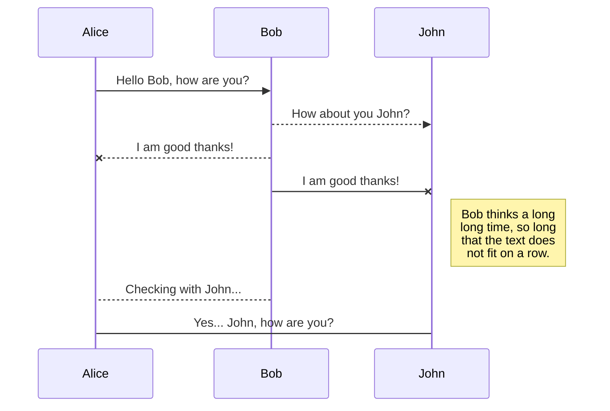
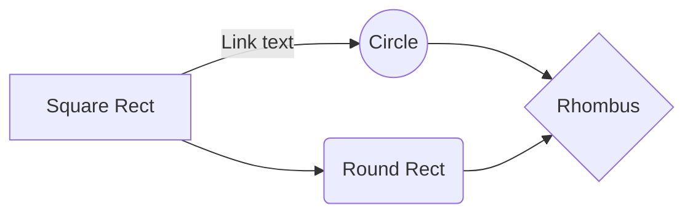

这是一篇用于测试 Markdown 渲染的 Demo 示例。

所有使用到的 Markdown 相关开源项目包括:

- [markdown-it](https://github.com/markdown-it/markdown-it) [^1]
  - [markdown-it-abbr](https://github.com/markdown-it/markdown-it-abbr)
  - [markdown-it-deflist](https://github.com/markdown-it/markdown-it-deflist)
  - [markdown-it-footnote](https://github.com/markdown-it/markdown-it-footnote)
  - [markdown-it-sub](https://github.com/markdown-it/markdown-it-sub)
  - [markdown-it-sup](https://github.com/markdown-it/markdown-it-sup)
- [mermaid](https://mermaidjs.github.io/) 很方便的代码->图形的转换工具
- [katex](https://katex.org/) 数学公式不用愁

[^1]: 可能是 JS 最好的 Markdown 渲染

## 例 1：中文排版

### 《论语学而篇第一》

*[孔子]: 名丘，字仲尼

**作者：** 孔子（<time>前 551 年 9 月 28 日－前 479 年 4 月 11 日</time>）

#### 本篇引语

《学而》是《论语》第一篇的篇名。《论语》中各篇一般都是以第一章的前二三个字作为该篇的篇名。《学而》一篇包括 16 章，内容涉及诸多方面。其中重点是「吾日三省吾身」；「节用而爱人，使民以时」；「礼之用，和为贵」以及仁、孝、信等道德范畴。

#### 原文

子曰：「学而时习之，不亦说乎？有朋自远方来，不亦乐乎？人不知，而不愠，不亦君子乎？」

#### 译文

孔子说：「学了又时常温习和练习，不是很愉快吗？有志同道合的人从远方来，不是很令人高兴的吗？人家不了解我，我也不怨恨、恼怒，不也是一个有德的君子吗？」

---

## 例 2：英文排版

Lorem Ipsum is simply dummy text of the printing and typesetting industry. Lorem Ipsum has been the industry's standard dummy text ever since the 1500s, when an unknown printer took a galley of type and scrambled it to make a type specimen book. It has survived not only five centuries, but also the leap into electronic typesetting, remaining essentially unchanged. It was popularised in the 1960s with the release of Letraset sheets containing Lorem Ipsum passages, and more recently with desktop publishing software like Aldus PageMaker including versions of Lorem Ipsum.

> Lorem ipsum dolor sit amet, consectetur adipisicing elit, sed do eiusmod tempor incididunt ut labore et dolore magna aliqua. Ut enim ad minim veniam, quis nostrud exercitation ullamco laboris nisi ut aliquip ex ea commodo consequat.


### List style in action

1. If you wish to succeed, you should use persistence as your good friend, experience as your reference, prudence as your brother and hope as your sentry.
2. Sometimes one pays most for the things one gets for nothing.
3. Only those who have the patience to do simple things perfectly ever acquire the skill to do difficult things easily.

---

## 例 3: Markdown 增强扩展

### Code

``` js
function helloWorld() {
  return 'hello world!';
}
```

[运行](https://codepen.io/AlloVince/pen/wLeYEb)

### SmartyPants

SmartyPants converts ASCII punctuation characters into "smart" typographic punctuation HTML entities. For example:

|                |ASCII                          |HTML                         |
|----------------|-------------------------------|-----------------------------|
|Single backticks|`'Isn't this fun?'`            |'Isn't this fun?'            |
|Quotes          |`"Isn't this fun?"`            |"Isn't this fun?"            |
|Dashes          |`-- is en-dash, --- is em-dash`|-- is en-dash, --- is em-dash|


### KaTeX

You can render LaTeX mathematical expressions using [KaTeX](https://khan.github.io/KaTeX/):

The *Gamma function* satisfying $\Gamma(n) = (n-1)!\quad\forall n\in\mathbb N$ is via the Euler integral

$$
\Gamma(z) = \int_0^\infty t^{z-1}e^{-t}dt\,.
$$

> You can find more information about **LaTeX** mathematical expressions [here](http://meta.math.stackexchange.com/questions/5020/mathjax-basic-tutorial-and-quick-reference).


### UML diagrams

You can render UML diagrams using [Mermaid](https://mermaidjs.github.io/). For example, this will produce a sequence diagram:



And this will produce a flow chart:


