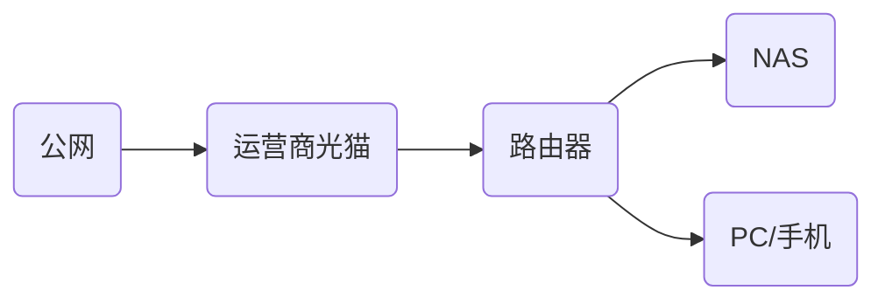
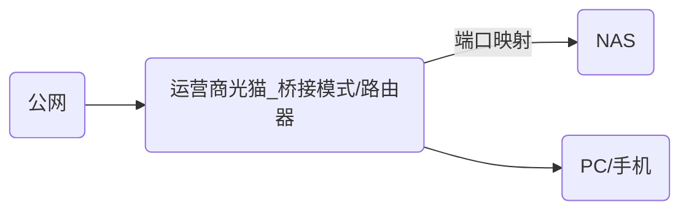
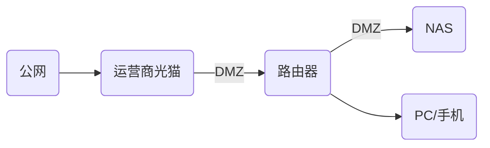

---
title: 使用 Synology(群晖) NAS + Docker 搭建个人私有云    
s: use-synology-nas-build-private-cloud    
date: 2019-01-31 09:40:48    
published: true
tags:    
 - Docker  
 - Synology  
 - NAS    
---    

对于个人用户来说，如果有大量的数据需要存储、备份、甚至做简单的大数据处理，NAS 无疑是一个更好<del>(更贵)</del>的选择，而部分高端 NAS 对 Docker 的支持，则将 NAS 的可玩性更提升到了一个新的高度。    
    
作为一个已经使用群晖 NAS 近 3 年的用户，个人的日常数据管理，数据同步，以及一些 Side Projects 的数据 ETL，数据分析等工作，都已经基于 NAS 完成，可以说将其视为个人私有云也不为过。特记录个人的一些使用经验以供参考。  
    
## NAS 的选择和套件安装    
 如果只是解决存储问题，其实现在很多路由器+移动硬盘就已经可以解决大部分需求了。选择 NAS 应该看重的是更好的稳定性和更强的可扩展性。如果是想折腾或者有一些编程经验的同学，请务必选择能支持 Docker 的 NAS。    
    
个人使用的是 2016 年购买的[群晖 DS916+](https://www.synology.com/zh-cn/company/news/article/Synology_Announces_DS916_plus)，CPU 为 Intel Pentium N3710 1.6G 4 核， 内存 8GB, 属于 4 盘位的主流型号， 虽然 CPU 略弱，但处理以磁盘 IO 为主的程序也已基本够用。    
    
以下则是个人目前实际安装的官方套件    
    
- File Station: 文件管理  
- Video Station: 视频管理  
- 媒体服务器: 实现视频串流  
- Cloud Sync: 将本地文件同步到公有云/云盘  
- 存储空间分析器  
- Docker    
  
  
  
虽然官方提供了种类繁多的套件，比如下载器、数据库、邮件服务器等，但其实想要更贴合自己的使用或开发习惯，使用 Docker 部署会更灵活一些，因此仅保留了存储和视频为主的官方套件。    
    
既然有官方，那么就会有非官方，比如[SynoCommunity](https://synocommunity.com)就是主要面向开发者的群晖套件社区。    
   
可以在`套件中心 -> 常规 -> 信任层级`中选择`Synology Inc. 和信任的发行者`， 然后在`套件中心->设置->套件来源`添加`http://packages.synocommunity.com/`， 就可以看到 SynoCommunity 社区提供的第三方套件了。    
    
第三方社区显然对开发者更加友好，给出了比官方更丰富的选择，如 Python, Git, Vim, WordPress 等开发者非常熟悉的名字，可以通过简单配置搭建一些基础开发环境。然而由于 Docker 的加持，我仅仅安装了方便 SSH 操作的 2 个套件：    
    
- Git Server  
- Z shell: 可以在 shell 中使用 zsh  
    
其他一些有趣的功能，全部基于 Docker 搭建， 如  
    
- 对象存储服务 (基于 Docker)    
- Aria2 下载服务 (基于 Docker)    
- Elastic + Kibana (基于 Docker)    
- API 若干，爬虫若干    
  
    
## NAS 盘位及存储规划    
 NAS 系统最珍贵的资源就是磁盘的盘位，一旦用掉后就很难再更改或者替换。    
  
不同于很多人将多块磁盘组成 RAID 的选择，对于 DS916+的 4 个盘位，我目前是这样使用的：   
    
- 盘位 1: Seagate 6TB NAS 绿盘, 磁盘格式 SHR + Btrfs, 主要存个人资料,影音游戏等    
- 盘位 2: Seagate 8TB NAS 绿盘, 磁盘格式 SHR + Btrfs, 主要存开发数据及备份数据    
- 盘位 3: Kingston 480GB SSD, 磁盘格式 SHR + Btrfs, 主要存放 Docker 及相关应用, 相当于系统盘    
- 盘位 4: Colorful 128GB SSD, 作为 NAS 缓存盘    
    
之所以完全不考虑 RAID，主要是基于这样的考虑：    
    
如果是非常重要的数据，即便组建 RAID，仍然会有整个 NAS 损坏或者丢失的可能性，不如使用自带的 Cloud Sync 套件将这部分数据直接同步到公有云/云盘,   [Cloud Sync 已经支持几乎国内外所有主流的公有云或云盘](https://www.synology.com/zh-cn/knowledgebase/DSM/help/CloudSync/cloudsync)，而近些年来，公有云存储的价格也已经非常友好，  比如[Microsoft OneDrive](https://onedrive.live.com/about/zh-cn/)就可以通过购买[Office365](https://www.office.com/)获得赠送，家庭版 300 多元/年的价格最大可以创建 6 个账号，  每个账号 1TB OneDrive 空间，即最大可以有总共 6TB 的公有云空间作为备份，完全可以覆盖绝大多数人的日常需求，且价格远远低于等容量磁盘，在可靠性方面更比自己的 NAS 设备要好。   
  
当然放弃 RAID 会出现数据落盘或同步过程中损坏的可能性，以及公有云的隐私风险，个人也是可以接受的。    
    
不使用 RAID，随即带来的一大好处就是磁盘利用率的提高，没必要一上来就买齐 4 块磁盘，完全可以一块用满了再买下一块，比如我的一块 6T 和一块 8T 磁盘间隔 1 年多时间，价格却相差不多，而 RAID5 则至少需要一次买 3 块磁盘且规格必须一致。(注: RAID 不同组合占用的磁盘空间可以使用群晖官网的[RAID 容量计算器](https://www.synology.com/zh-cn/support/RAID_calculator)，非常形象)  
    
盘位 3 使用 SSD， 则是考虑到除了存储外，还需要运行大量应用程序，SSD 带来的性能提升是非常巨大的，测试证明在小文件多写入（如爬虫）的场景下，换上 SSD 后系统负载可以下降近一倍。    
    
要注意的是需要在`套件中心->设置->常规->默认存储空间`中，将默认存储空间设置为 SSD 磁盘。    
    
至于盘位 4, 则是由于 DS916+型号较老，而盘位也不想空闲，用低价的 SSD 作为缓存过渡，必要时可以去掉缓存换上第三块数据盘。    
    
群晖系统中单 SSD 只能支持读取缓存，写入缓存还需要再占用一个盘位，但显然不会有人为了缓存牺牲宝贵的盘位，所以在新版的 DS918+等型号中缓存已经不再占用盘位了，值得表扬。    
    
  
## NAS 开放公网访问  
  
如果在公网需要访问 NAS，群晖提供了[QuickConnect](https://www.synology.com/zh-cn/knowledgebase/DSM/help/DSM/Tutorial/cloud_set_up_quickconnect)功能， 即可以通过`http://QuickConnect.to/yourID`从外网直接访问 NAS。  
  
根据[QuickConnect 白皮书](https://global.download.synology.com/download/Document/WhitePaper/Synology_QuickConnect_White_Paper.pdf)可以知道，这个功能是先由群晖提供的中继服务器将流量进行转发，然后再尝试建立直链。鉴于公网的复杂性，直链未必能每次都建立成功，此时传输速度就很感人了。因此如果希望在公网较快且稳定的访问 NAS，还是需要想别的办法。  
  
目前国内常见的家庭网络环境是这样的  
  

  
因此一个公网访问到 NAS 需要可能会经过光猫、路由器两跳，对此常用的解决方法是端口映射、内网穿透等，由于路由器和运营商情况不同，配置方法各异，这里就不展开讲了。  
  
相对比较好的方案是将光猫改为桥接模式，由路由器拨号，路由器再做端口映射到 NAS， 如下图  
  

  
或者更简单粗暴的直接配置 DMZ, 将 NAS 完全暴露在公网  
  

  
但上述方法都需要有运营商提供的光猫的管理权限，可以联系运营商客服或维修人员，虽然有些麻烦，但是强烈建议有条件的同学尝试，实测上海电信 200M 完全可以在公网流畅播放 NAS 视频。  
  
### NAS 绑定个性化域名  
  
能通过公网访问 NAS 后，如果家庭网络重新拨号，IP 地址会变化，因此下一步要做的当然是通过域名访问，将一个动态变化的 IP 与域名进行绑定，这类服务称为 [DDNS](https://en.wikipedia.org/wiki/Dynamic_DNS)，比如很多人熟悉的花生壳等。  
  
群晖在 `控制面板->外部访问->DDNS`中已经支持了绝大多数国内外主流的 DDNS 服务商，包括群晖自己，可以根据情况配置。  
  
很多 DDNS 服务商提供的是二级域名，如群晖自己就提供了`YourID.synology.me`这样的二级域名。如果有买过顶级域名，可以将域名托管到 DNSPod 等域名服务商，群晖同样提供了支持，这里有篇[图文配置](https://mapgun.com/archives/2287)可供参考。  
  
需要注意的是，如果你的家庭网络如上文有光猫+路由器两跳，或者路由器配置了一些不可描述的服务时，群晖有可能无法正确解析自己的公网地址。因此如果路由器本身支持 DDNS，建议首选在路由器上做配置。不过遗憾的是运营商都屏蔽了 80 和 443 端口，如果搭建网站的话，在公网访问仍然需要输入端口号。  
  
### 使用 https 访问 NAS  
  
在公网访问 NAS，十分有必要使用 https 加密访问，否则敏感的个人数据很容易被拦截或泄露，群晖 DSM 自己签发了一个证书，访问起来浏览器会标记为不安全，如果使用了自己的顶级域名，就更加难以忍受。  
  
目前 [Let's encrypt](https://letsencrypt.org/) 已经可以免费签发泛域名证书，完全可以通过脚本定期申请、更新证书，从而实现公网使用顶级域名通过 https 直接访问 NAS 的良好体验，更新脚本可以使用 [andyzhshg/syno-acme](https://github.com/andyzhshg/syno-acme) 以及其[说明](http://www.up4dev.com/2018/05/29/synology-ssl-wildcard-cert-update/)  
  
    
## 打造友好的 SSH 环境    
 虽然群晖的开发套件也提供了一定图形界面，但体验并不好，尤其是 Docker 这种需要强配置的应用，如果有能力的话，还是尽量选择 SSH 使用命令行操作，这样就能使用 Docker Compose，一键部署较复杂的应用或应用组合了。  
  
由于群晖使用的系统是自己基于 BSD 的魔改版本：  
  
```plain  
$cat /proc/version
Linux version 3.10.105 (root@build4) (gcc version 4.9.3 20150311 (prerelease) (crosstool-NG 1.20.0) ) #23824 SMP Tue Dec 25 18:25:37 CST 2018 
```  
  
与 Ubuntu/CentOS 等习惯了的 Linux 发行版相比，应该是出于稳定性考虑，去掉了很多常用的开发相关软件包，为了效率考虑，首先应该对 SSH 登录做一些优化。  
  
### 基于私钥登录 SSH  
  
SSH 远程登录可以在 `控制面板->终端机和SNMP->终端机->启用SSH功能`中开启。 出于安全性考虑，应当避免使用 22 端口。假设 NAS 在内网的 IP 为 `192.168.1.11`，端口为 `9012`， 用户名为 `allovince` 可以通过  
  
```plain  
ssh allovince@192.168.1.11 -p 9012  
```  
  
并输入密码登录。如果需要以 root 身份运行程序，可以在命令前加`sudo`或通过  
  
```plain  
sudo -i  
```  
  
切换为 root。由于群晖系统的限制，是无法使用 root 用户直接登录的。  
  
如果不想每次都输入密码，可以通过私钥登录，首选需要在`控制面板->用户账号->高级设置`中确保已经勾选`启用家目录服务`，账号 allovince 对应的家目录就是`/var/services/homes/allovince`。然后在本机用`ssh-keygen`生成好私钥。接下来需要将公钥复制到 NAS，可以通过  
  
```plain  
ssh-copy-id allovince@192.168.1.11 -p 9012  
```  
  
输入登录密码运行完毕后，家目录下会生成`.ssh`文件夹和对应文件。由于是 NAS， `.ssh`下文件权限需要做一些调整  
  
```plain  
chmod 0700 ~/.ssh  
chmod 0644 ~/.ssh/authorized_keys  
chmod 0700 ~/.ssh/id_rsa  
chmod 0644 ~/.ssh/id_rsa.pub  
```  
  
然后编辑文件 `sudo vi /etc/ssh/sshd_config`  
  
确保以下内容未被注释  
  
```plain  
RSAAuthentication yes  
PubkeyAuthentication yes  
```  
  
最后重启 sshd 服务  
```plain  
sudo synoservicectl --restart sshd  
```  
  
另外在实现私钥登录后，出于安全考虑，建议直接关闭密码登录， 同样是在配置文件中设置`PasswordAuthentication no`， 并重启服务  
  
### 安装 oh-my-zsh  
  
如果希望使用`oh-my-zsh`， 可以按照上文，安装第三方套件`Z shell`和`Git Server`后，按照 [oh-my-zsh](https://github.com/robbyrussell/oh-my-zsh) 文档说明安装即可  
  
  
## 群晖 NAS 下 Docker 使用的注意点  
  
由于群晖底层系统 Linux 的特殊性，所安装的 Docker 也是群晖的定制版本，目前最新版本是 17.05.0-ce， 落后最新版一个大版本。  
  
```shell 
$ docker -v  
Docker version 17.05.0-ce, build 9f07f0e-synology  
 ```  
安装套件后 Docker Compose 也会一同安装， 同样也是旧版本  
  
```plain  
$ docker-compose -v  
docker-compose version 1.14.0, build c7bdf9e  
```  
  
参考这份[Compose 文件与 Docker Engine 版本对照表](https://docs.docker.com/compose/compose-file/), Docker v17.05 只能支持 Compose 文件 v3.2， 建议在 docker compose 文件中都加入  
  
``` yaml  
version: '3.2'  
```  
  
同样由于缺失`systemctl`等软件，Kubernetes 也是无法安装到群晖 NAS 的。  
  
## NAS 上搭建基于 Minio 的私有云对象存储  
  
对于开发者来说，各种公有云的对象存储几乎已经成为基础设施，无论文件上传、CDN、备份，都少不了要和对象存储打交道，对于自己的个人项目来说，如果能有一套 API 兼容公有云，又能部署在自己服务器上的对象存储的话，无疑能极大的提升效率，还可以灵活的在公有云和私有云之间无缝迁移数据。  
  
幸运的是已经有同样想法的开发者开发了[Minio](https://minio.io/)，Minio 使用 golang 实现，单文件最高支持 5TB，提供了与 AWS S3 兼容的 API，同时自带管理 UI，也提供了主流语言的 SDK，可以说非常友好了。  
  
Minio 的部署可以参考如下配置  
  
``` yaml  
version: '3.2'   
services:    
   minio:    
     image: minio/minio:latest    
     restart: always    
     container_name: minio    
     volumes:    
       - /volume2/s3/minio:/data    
     command:    
       minio server /data    
     ports:    
       - "9000:9000" 
```  
  
保存为`minio.yml`。volumes 一栏是需要挂载的 NAS 路径， 然后运行  
  
```plain  
sudo docker-compose -f minio.yml up -d  
```  
  
访问 NAS 的 9000 端口，即可看到 Minio 的管理界面  
  
  
  
Minio 会自动生成鉴权用的 Access Key 和 Secret Key， 可以使用 `sudo docker logs minio` 查看  
  
## Treafik 实现服务自动路由及自动更新 SSL 证书  
  
上面以 Minio 为例演示了在群晖 NAS 上通过 Docker 搭建服务的方式，不过服务启动多了，会产生一些不便，比如每个服务都要占用若干端口，使用的时候还要背下端口号；http 服务在公网访问会有安全隐患；https 服务要申请配置证书很麻烦……  
  
个人非常喜欢的 [Traefik](https://traefik.io/) 就是解决这一问题的银弹，盗用 Traefik 官方的示意图：  
  
  
  
Traefik 可以看做是一个具备服务发现机制的动态路由，比如再搭建好 Traefik 之后，只要在上述的 Minio 服务中增加几行注解：  
  
``` yaml  
services:    
   minio:    
     ...  
     labels:
       - traefik.port=9000    
       - traefik.frontend.rule=Host:minio.yourdomain.com
       - traefik.frontend.entryPoints=http,https 
```  
  
就可以直接通过`minio.yourdomain.com`访问 Minio 服务，不需要再记住端口号；同时 Traefik 会自动申请`minio.yourdomain.com`的 SSL 证书，自动更新；如果后端启动多个 Docker 进程，Traefik 会实现负载均衡；同时还提供了一个简单的 UI 界面方便查看当前的服务状态：  
  
  
  
在单机环境下，Traefik 是通过监听`/var/run/docker.sock`获取 Docker 启动/停止容器的事件来实现服务发现的。部署方式如下  
  
``` yaml  
version: '3.2'   
services:    
  traefik-nas:    
    image: traefik:1.7-alpine    
    command: --api --docker    
    restart: always    
    ports:    
      - "8080:80"    
      - "8443:443"    
    volumes:    
      - /var/run/docker.sock:/var/run/docker.sock    
      - ./traefik.toml:/etc/traefik    
    environment:    
      DNSPOD_API_KEY: dnspod_id,dnspod_secret  
```  
  
挂载的同目录下 Traefik 配置文件`traefik.toml` 是[TOML 格式](https://github.com/toml-lang/toml)的，内容如下  
  
``` toml  
[entryPoints]    
  [entryPoints.http]    
  address = ":80"    
  compress = true     
  [entryPoints.https]    
  address = ":443"    
  compress = true    
    [entryPoints.https.tls]    

[acme]
email = "yourmail@gmail.com"
storage = "/etc/traefik/acme.json"
onHostRule = true
onDemand = false
entryPoint = "https"    
  [acme.dnsChallenge]    
    provider = "dnspod"    
  delayBeforeCheck = 5    

[[acme.domains]]    
  main = "*.yourdomain.com"  
```  
  
这个配置文件中展示的是域名托管于 DNSPod 时的配置，[其他主流的 DNS 服务商 Traefik 也都提供了原生支持](https://docs.traefik.io/configuration/acme/#provider)。  
  
当 Treafik 启动后，会根据配置文件去 Lets Encrypt 申请`*.yourdomain.com`的泛域名 SSL 证书，目前泛域名 SSL 证书只限 DNS-01 Challenge 的方式，即根据环境变量`DNSPOD_API_KEY`传入的 DNSPod API 秘钥，调用 DNSPod API 在域名添加 txt 记录，然后延迟`delayBeforeCheck`秒后检查 DNS 记录，从而确认域名的所有权。SSL 证书最终会以 JSON 格式保存于配置文件指定的路径`/etc/traefik/acme.json`  
  
由于申请的是泛域名证书，因此新启动服务时，只需要想一个二级域名就可以了，不必再绑定端口。如果想开启 Traefik Dashboard 的访问，同样只需要增加几行注解  
  
```plain  
services:    
  traefik-nas:    
    ...  
 labels:
      - traefik.port=8080    
      - traefik.frontend.rule=Host:traefik.yourdomain.com    
      - traefik.frontend.entryPoints=http,https    
      - traefik.frontend.auth.basic=username:password  
```  
  
由于 Traefik Dashboard 内容较为敏感，建议如上通过注解加上 HTTP Basic Auth，注解内容可以使用  
  
```plain  
htpasswd -c $(pwd)/.htpasswd username  
```  
  
生成。
